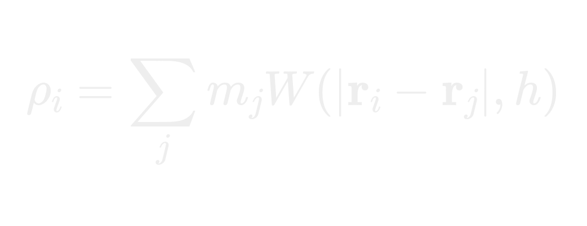
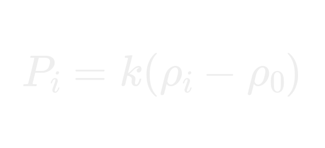
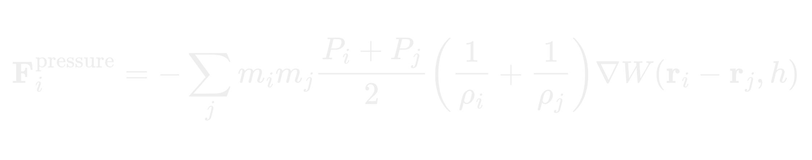
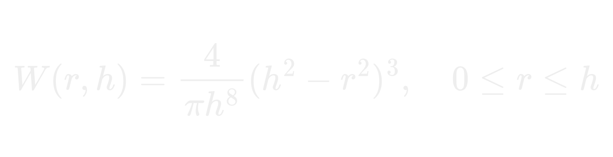

# 🌊 2D SPH Fluid Simulator


A high-performance, real-time 2D fluid solver implementing the **Smooth Particle Hydrodynamics (SPH)** method. Written in modern C++, this project leverages OpenGL for rendering and ImGui for dynamic, on-the-fly parameter tuning. 

Designed to bridge theoretical computational fluid dynamics (CFD) with real-time interactive graphics, this solver bypasses traditional grid-based Navier-Stokes limitations in favor of a mesh-free, Lagrangian particle formulation.

## ✨ Key Features

* **Mesh-Free Lagrangian Simulation:** Accurately models fluid dynamics using discrete particle interactions, naturally handling complex topological changes like splashing and merging.
* **Real-Time Parameter Control:** Fully integrated ImGui dashboard allows instant manipulation of pressure stiffness, smoothing radius, and system gravity.
* **Optimized Neighbor Search:** Implements a uniform spatial grid partition to accelerate neighbor-finding within the smoothing radius $h$, maintaining interactive framerates.
* **Data Visualization:** Real-time color-mapping of particles based on localized density and pressure fields for deep analytical feedback.

## 📐 Mathematical Formulation

The engine solves a weakly compressible model of fluid flow using standard SPH interpolation theory. Continuous field properties are approximated across discrete particles using the **Poly6 Smoothing Kernel**.

### Density Estimation
To ensure mass conservation, the localized density at particle $i$ is calculated by summing the mass contributions of all neighboring particles $j$ within the smoothing radius:



### Equation of State (Tait's Equation)
Fluid pressure is derived from the density variance against a target rest density ($\rho_0$). The stiffness multiplier ($k$) dictates the incompressibility of the fluid:



### Pressure Gradient Force
The resulting pressure differential between interacting particles drives the fluid motion, calculated via a symmetric pressure gradient formulation to satisfy Newton's Third Law:



*(Kernel formulation reference)*:

*Where $r$ is the scalar distance between particles, $h$ is the smoothing length, and $C$ is the normalization constant.*

## ⚙️ System Architecture

* **Integration Scheme:** Temporal advancement is handled via an Explicit Euler integrator, updating particle kinematics ($x, v$) based on accumulated internal (pressure) and external (gravity) forces.
* **Boundary Handling:** Particles are constrained within a localized coordinate space using penalty-based collision responses to prevent domain escape and simulate rigid container walls.
* **Rendering Pipeline:** Data is pushed directly to the GPU via OpenGL, rendering discrete points mapped to dynamic color gradients representing physical states.

## 🚀 Getting Started

**Prerequisites:**
*   A C++17 compatible compiler (GCC, Clang, or MSVC)
*   **SDL3** development libraries installed
*   **OpenGL** headers

```bash
# Clone the repository
git clone [https://github.com/AkshatSingh-90056/Fluid-Simulator.git](https://github.com/AkshatSingh-90056/Fluid-Simulator.git)
cd Fluid-Simulator

# Build the project using Make
make

# Run the executable
./main
